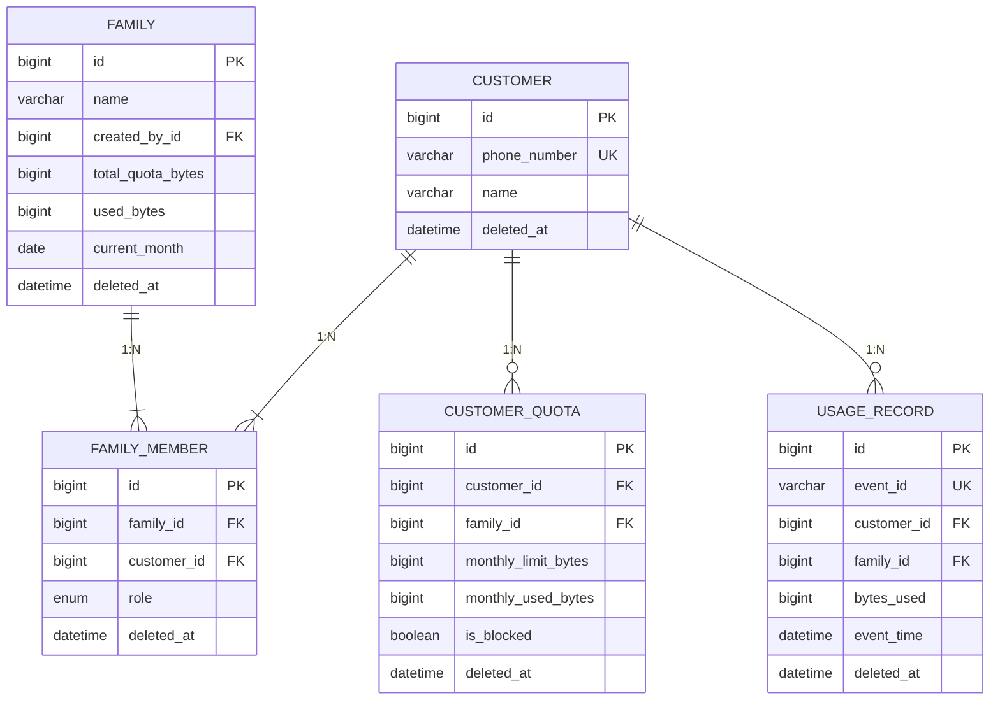
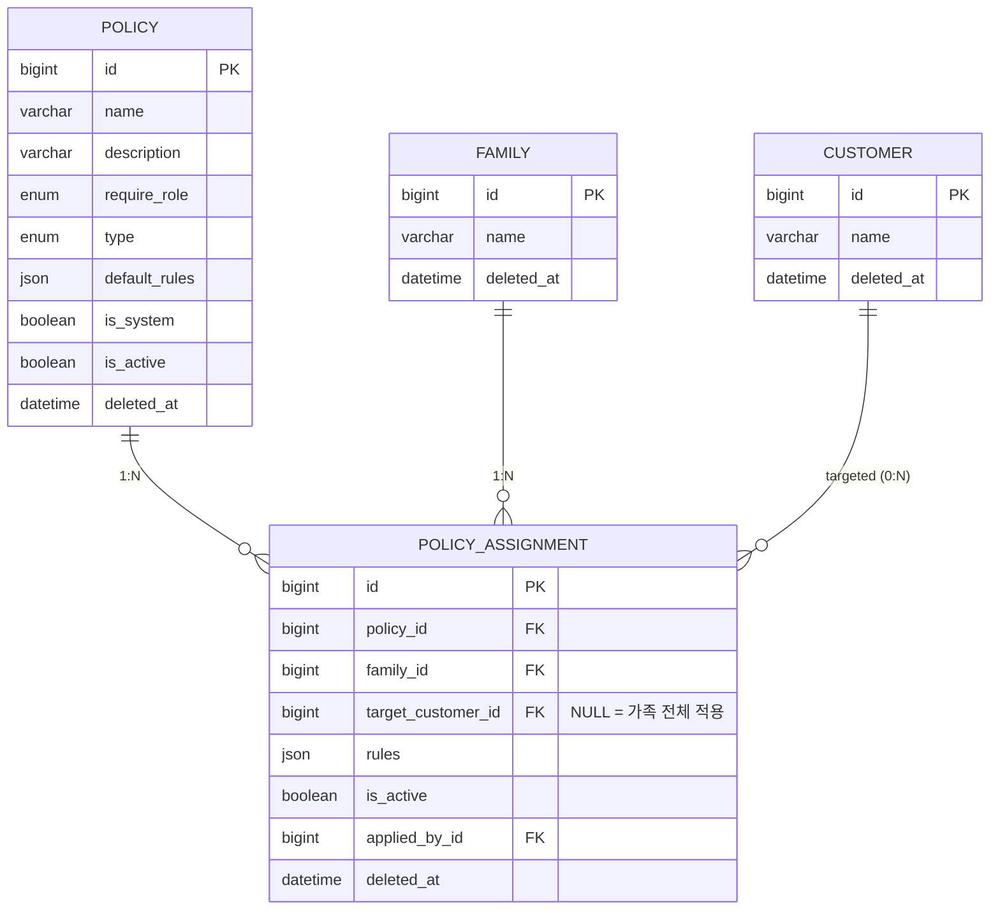
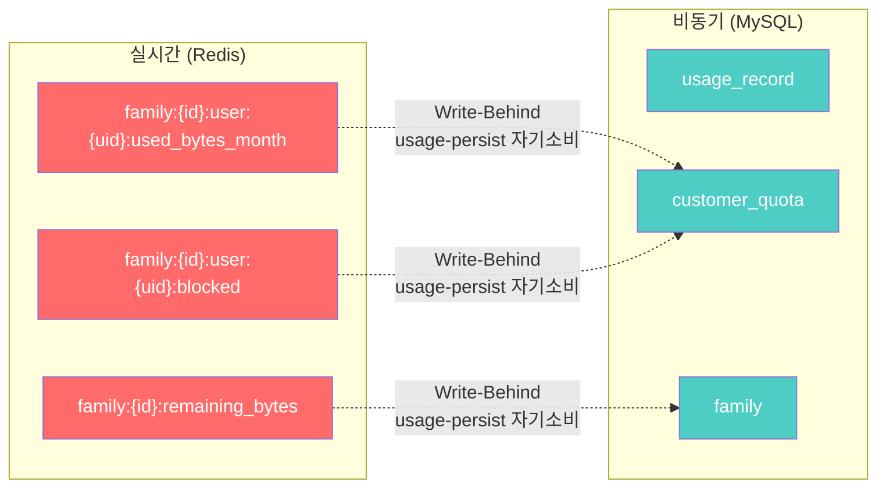

# 실시간 가족 데이터 통합 관리 시스템 - ERD 설계서

> **문서 버전**: v10.4
> **변경 이력**: v10.4 - CUSTOMER_QUOTA 테이블 created_at 컬럼 추가 (다른 테이블과 일관성 확보, BaseEntity 동기화) | v10.3 - FAMILY_MEMBER 테이블 joined_at 컬럼 잔존 참조 제거 (다이어그램-상세 정의 동기화) | v10.2 - POLICY 테이블 is_active → is_active 리네이밍 (POLICY_ASSIGNMENT.is_active, API JSON isActive와 일관성 통일) | v10.1 - POLICY_ASSIGNMENT 테이블에 created_at, updated_at 컬럼 추가 (다른 테이블과 일관성 확보) | v10.0 - web-core 서브도메인 분리 Major 버전 동기화 | v9.0 - api-spec 최종 동기화: API 경로 참조 업데이트 | v8.1 - POLICY 테이블 is_active 필드 추가, CUSTOMER/INVITE phone_number VARCHAR(11) 숫자만 형식으로 변경 | v8.0 - 전체 문서 버전 통일 (공유 Major + 독립 Minor 체계 도입) | v6.2 - ADMIN 테이블 phone_number 삭제, email을 NOT NULL UNIQUE 로그인 ID로 변경 | v6.1 - POLICY 엔티티 ERD 다이어그램에 description, require_role, default_rules 필드 추가 (섹션 3.7 상세 정의와 동기화) | v6.0 - FAMILY_GROUP → FAMILY 이름 변경 | v5.0 - USER→CUSTOMER/ADMIN 분리, MEMBER_QUOTA→CUSTOMER_QUOTA, 일별→월별, FAMILY_QUOTA 삭제→FAMILY_GROUP 통합, POLICY.rules→POLICY_ASSIGNMENT 이동, TINYINT→BOOLEAN, AUDIT_LOG/INVITE 2차 개발 레이블링 | v4.0 - Soft Delete 전체 적용, API 도메인 그룹핑 반영, REST 알림 API 지원 인덱스 추가, Read Path 업데이트 | v3.0 - 초기 작성

---

## 1. ERD 개요

### 1.1 설계 원칙

| 원칙 | 설명 |
| --- | --- |
| **Source of Truth** | MySQL이 모든 영속 데이터의 원본 (Redis는 캐시/실시간 상태용) |
| **Write-Behind** | 실시간 경로(Redis) → 비동기 저장(Kafka usage-persist → MySQL) |
| **Idempotency** | `event_id` UNIQUE 제약으로 중복 Insert 방지 |
| **Soft Delete** | 전체 테이블에 `deleted_at` 컬럼 적용. NULL = 활성, NOT NULL = 삭제. UNIQUE 제약에 `deleted_at` 포함하여 삭제 후 재생성 허용 |
| **바이트 단위 통일** | 모든 데이터량 필드는 `BIGINT` 바이트 단위 |

### 1.2 엔티티 목록

| # | 엔티티 | 설명 | 예상 레코드 수 |
| --- | --- | --- | --- |
| 1 | `customer` | 시스템 사용자 (가족 구성원) | ~1,000,000 |
| 2 | `admin` | 백오피스 운영자 | ~100 |
| 3 | `family` | 가족 그룹 | ~250,000 |
| 4 | `family_member` | 가족-사용자 매핑 (N:M 해소) | ~1,000,000 |
| 5 | `customer_quota` | 구성원별 월별 한도/사용량/차단 상태 | ~1,000,000/월 |
| 6 | `usage_record` | 데이터 사용 이력 (Write-Behind 저장) | ~432,000,000/일 |
| 7 | `policy` | 정책 템플릿 정의 | ~100 |
| 8 | `policy_assignment` | 정책 적용 매핑 | ~500,000 |
| 9 | `notification_log` | 알림 발송 이력 | ~수백만/월 |
| 10 | `audit_log` | 감사 로그 (정책 변경, 차단 이력 등) (2차 개발) | ~수십만/월 |
| 11 | `invite` | 가족 초대 (2차 개발) | ~수만 |

---

## 2. ERD 다이어그램

### 2.1 전체 ERD

```mermaid
erDiagram
    CUSTOMER ||--|{ FAMILY_MEMBER : "belongs to"
    FAMILY ||--|{ FAMILY_MEMBER : "contains"
    CUSTOMER ||--o{ CUSTOMER_QUOTA : "has monthly quota"
    FAMILY ||--o{ CUSTOMER_QUOTA : "scoped to"
    CUSTOMER ||--o{ USAGE_RECORD : "generates"
    FAMILY ||--o{ USAGE_RECORD : "belongs to"
    POLICY ||--o{ POLICY_ASSIGNMENT : "applied as"
    FAMILY ||--o{ POLICY_ASSIGNMENT : "receives"
    CUSTOMER ||--o{ POLICY_ASSIGNMENT : "targeted by"
    CUSTOMER ||--o{ NOTIFICATION_LOG : "receives"
    FAMILY ||--o{ NOTIFICATION_LOG : "scoped to"
    FAMILY ||--o{ INVITE : "has"
    CUSTOMER ||--o{ AUDIT_LOG : "performs"

    CUSTOMER {
        bigint id PK "AUTO_INCREMENT"
        varchar phone_number UK "NOT NULL, 숫자만 11자리 (01012345678, 로그인 ID)"
        varchar password_hash "NOT NULL, BCrypt 해시"
        varchar name "NOT NULL, 사용자 이름"
        varchar email "NULL, 이메일"
        datetime created_at "DEFAULT CURRENT_TIMESTAMP"
        datetime updated_at "DEFAULT CURRENT_TIMESTAMP"
        datetime deleted_at "NULL, Soft Delete"
    }

    ADMIN {
        bigint id PK "AUTO_INCREMENT"
        varchar email UK "NOT NULL, 이메일 (로그인 ID)"
        varchar password_hash "NOT NULL, BCrypt 해시"
        varchar name "NOT NULL, 운영자 이름"
        datetime created_at "DEFAULT CURRENT_TIMESTAMP"
        datetime updated_at "DEFAULT CURRENT_TIMESTAMP"
        datetime deleted_at "NULL, Soft Delete"
    }

    FAMILY {
        bigint id PK "AUTO_INCREMENT"
        varchar name "NOT NULL, 가족 그룹명"
        bigint created_by_id FK "NOT NULL → customer.id, 그룹 최초 생성자 (이력/감사 전용)"
        bigint total_quota_bytes "NOT NULL, DEFAULT 100GB"
        bigint used_bytes "NOT NULL DEFAULT 0, 현재 월 사용량(바이트)"
        date current_month "NOT NULL, 현재 과금 월 (매월 1일 기준)"
        datetime created_at "DEFAULT CURRENT_TIMESTAMP"
        datetime updated_at "DEFAULT CURRENT_TIMESTAMP"
        datetime deleted_at "NULL, Soft Delete"
    }

    FAMILY_MEMBER {
        bigint id PK "AUTO_INCREMENT"
        bigint family_id FK "NOT NULL → family.id"
        bigint customer_id FK "NOT NULL → customer.id"
        enum role "MEMBER | OWNER"
        datetime deleted_at "NULL, Soft Delete"
    }

    CUSTOMER_QUOTA {
        bigint id PK "AUTO_INCREMENT"
        bigint customer_id FK "NOT NULL → customer.id"
        bigint family_id FK "NOT NULL → family.id"
        bigint monthly_limit_bytes "NULL = 무제한"
        bigint monthly_used_bytes "NOT NULL DEFAULT 0"
        date current_month "NOT NULL, 해당 월 (매월 1일 기준)"
        boolean is_blocked "NOT NULL DEFAULT FALSE"
        varchar block_reason "NULL, 차단 사유 코드"
        datetime created_at "DEFAULT CURRENT_TIMESTAMP"
        datetime updated_at "DEFAULT CURRENT_TIMESTAMP"
        datetime deleted_at "NULL, Soft Delete"
    }

    USAGE_RECORD {
        bigint id PK "AUTO_INCREMENT"
        varchar event_id UK "NOT NULL, Idempotency 키"
        bigint customer_id FK "NOT NULL → customer.id"
        bigint family_id FK "NOT NULL → family.id"
        bigint bytes_used "NOT NULL, 사용 바이트"
        varchar app_id "NULL, 앱 식별자"
        datetime event_time "NOT NULL, 이벤트 발생 시각"
        datetime created_at "DEFAULT CURRENT_TIMESTAMP"
        datetime deleted_at "NULL, Soft Delete"
    }

    POLICY {
        bigint id PK "AUTO_INCREMENT"
        varchar name "NOT NULL, 정책 이름"
        varchar description "NULL, 정책 설명"
        enum require_role "NOT NULL, DEFAULT 'MEMBER', 최소 요구 역할"
        enum type "MONTHLY_LIMIT | TIME_BLOCK | APP_BLOCK | MANUAL_BLOCK"
        json default_rules "NOT NULL, 기본 정책 규칙 JSON"
        boolean is_system "DEFAULT FALSE, 시스템 정책 여부"
        boolean is_active "NOT NULL DEFAULT TRUE, 정책 활성화 여부"
        datetime created_at "DEFAULT CURRENT_TIMESTAMP"
        datetime updated_at "DEFAULT CURRENT_TIMESTAMP"
        datetime deleted_at "NULL, Soft Delete"
    }

    POLICY_ASSIGNMENT {
        bigint id PK "AUTO_INCREMENT"
        bigint policy_id FK "NOT NULL → policy.id"
        bigint family_id FK "NOT NULL → family.id"
        bigint target_customer_id FK "NULL → customer.id (NULL=가족 전체)"
        json rules "NOT NULL, 정책 규칙 JSON"
        boolean is_active "NOT NULL DEFAULT TRUE"
        datetime applied_at "DEFAULT CURRENT_TIMESTAMP"
        bigint applied_by_id FK "NOT NULL → customer.id, 적용자"
        datetime created_at "DEFAULT CURRENT_TIMESTAMP"
        datetime updated_at "DEFAULT CURRENT_TIMESTAMP"
        datetime deleted_at "NULL, Soft Delete"
    }

    NOTIFICATION_LOG {
        bigint id PK "AUTO_INCREMENT"
        bigint customer_id FK "NOT NULL → customer.id"
        bigint family_id FK "NOT NULL → family.id"
        enum type "THRESHOLD_ALERT | BLOCKED | UNBLOCKED | POLICY_CHANGED"
        text message "NOT NULL, 알림 메시지"
        json payload "NULL, 추가 데이터"
        boolean is_read "NOT NULL DEFAULT FALSE"
        datetime sent_at "DEFAULT CURRENT_TIMESTAMP"
        datetime deleted_at "NULL, Soft Delete"
    }

    %% === 2차 개발 ===
    AUDIT_LOG {
        bigint id PK "AUTO_INCREMENT"
        bigint actor_id FK "NULL → customer.id, 수행자"
        varchar action "NOT NULL, 수행 액션"
        varchar entity_type "NOT NULL, 대상 엔티티 종류"
        bigint entity_id "NOT NULL, 대상 엔티티 ID"
        json old_value "NULL, 변경 전 값"
        json new_value "NULL, 변경 후 값"
        varchar ip_address "NULL, 요청 IP"
        datetime created_at "DEFAULT CURRENT_TIMESTAMP"
        datetime deleted_at "NULL, Soft Delete"
    }

    %% === 2차 개발 ===
    INVITE {
        bigint id PK "AUTO_INCREMENT"
        bigint family_id FK "NOT NULL → family.id"
        varchar phone_number "NOT NULL, 숫자만 11자리, 초대 대상 전화번호"
        enum role "MEMBER | OWNER"
        enum status "PENDING | ACCEPTED | EXPIRED | CANCELLED"
        datetime expires_at "NOT NULL, 만료 시각"
        datetime created_at "DEFAULT CURRENT_TIMESTAMP"
        datetime deleted_at "NULL, Soft Delete"
    }
```



### 2.2 핵심 도메인 ERD (Core Domain)

사용자-가족-쿼터 핵심 관계만 추출한 다이어그램:



### 2.3 정책 도메인 ERD (Policy Domain)



---

## 3. 엔티티 상세 정의

### 3.1 CUSTOMER (사용자)

시스템의 모든 일반 사용자(가족 구성원)를 관리하는 중심 엔티티.

**설계 의도**: 인증과 권한의 단일 진입점. CUSTOMER/ADMIN 구분은 테이블 자체로 분리하고 JWT role 클레임으로 식별. 전화번호를 로그인 ID로 사용하여 모바일 중심 UX를 지원.

**데이터 생명주기**:
- **생성**: 회원가입 시 (또는 초대 수락 시 자동 생성)
- **조회**: 로그인(`POST /customers/login` — CUSTOMER 전용 엔드포인트)
- **수정**: 프로필 변경 시 `updated_at` 갱신
- **삭제**: Soft Delete — 탈퇴 시 `deleted_at` 설정, 동일 전화번호 재가입 허용

**핵심 설계 결정**:
- `phone_number`를 UNIQUE로 설정하여 로그인 ID 역할 (이메일은 선택 필드)
- JWT 토큰 발급 시 `customer.id`와 `family_member` 테이블에서 추론한 `familyId`를 페이로드에 포함
- BCrypt 해시 저장 (`password_hash`) — 평문 비밀번호는 시스템에 저장되지 않음

| 컬럼 | 타입 | 제약조건 | 설명 |
| --- | --- | --- | --- |
| `id` | BIGINT | PK, AUTO_INCREMENT | 사용자 고유 ID |
| `phone_number` | VARCHAR(11) | NOT NULL, UNIQUE | 전화번호 (숫자만 11자리, 01012345678, 로그인 ID로 사용) |
| `password_hash` | VARCHAR(255) | NOT NULL | BCrypt 해시된 비밀번호 |
| `name` | VARCHAR(100) | NOT NULL | 사용자 이름 |
| `email` | VARCHAR(255) | NULL | 이메일 (선택) |
| `created_at` | DATETIME | DEFAULT CURRENT_TIMESTAMP | 생성일시 |
| `updated_at` | DATETIME | DEFAULT CURRENT_TIMESTAMP | 수정일시 |
| `deleted_at` | DATETIME | NULL | Soft Delete (NULL = 활성) |

**인덱스**:
- `idx_customer_phone` : `phone_number` (로그인 조회)
- `idx_customer_email` : `email` (이메일 조회)

**Soft Delete UNIQUE**: `UNIQUE(phone_number, deleted_at)` — 삭제된 사용자의 전화번호 재사용 허용 (MySQL에서 NULL은 UNIQUE 제약에서 중복 허용)

### 3.2 ADMIN (백오피스 운영자)

백오피스 운영을 위한 독립 엔티티. 가족 도메인과 FK 관계 없음.

**설계 의도**: 가족 도메인과 분리된 독립 운영자 테이블. email 기반 로그인으로, 전용 엔드포인트(`POST /admin/login`)를 통해 접근.

**데이터 생명주기**:
- **생성**: 내부 운영 절차에 따라 생성
- **조회**: 관리자 로그인(`POST /admin/login` — ADMIN 전용 엔드포인트)
- **수정**: 프로필 변경 시 `updated_at` 갱신
- **삭제**: Soft Delete — `deleted_at` 설정

**핵심 설계 결정**:
- email 기반 로그인 (CUSTOMER의 phone_number 기반과 독립된 인증 체계)
- JWT 토큰 발급 시 `admin.id`와 role 클레임을 페이로드에 포함

| 컬럼 | 타입 | 제약조건 | 설명 |
| --- | --- | --- | --- |
| `id` | BIGINT | PK, AUTO_INCREMENT | 운영자 고유 ID |
| `email` | VARCHAR(255) | NOT NULL, UNIQUE | 이메일 (로그인 ID로 사용) |
| `password_hash` | VARCHAR(255) | NOT NULL | BCrypt 해시된 비밀번호 |
| `name` | VARCHAR(100) | NOT NULL | 운영자 이름 |
| `created_at` | DATETIME | DEFAULT CURRENT_TIMESTAMP | 생성일시 |
| `updated_at` | DATETIME | DEFAULT CURRENT_TIMESTAMP | 수정일시 |
| `deleted_at` | DATETIME | NULL | Soft Delete (NULL = 활성) |

**인덱스**:
- `idx_admin_email` : `email` (로그인 조회)

**Soft Delete UNIQUE**: `UNIQUE(email, deleted_at)` — 삭제된 운영자의 이메일 재사용 허용

**비즈니스 규칙**:
- 백오피스 API(`/admin/*`) 전용 접근
- 정책 템플릿 CRUD 관리

### 3.3 FAMILY (가족)

데이터를 공유하는 가족 단위. 최대 10명까지 구성 가능.

**설계 의도**: 시스템의 핵심 도메인 엔티티. 가족 단위로 데이터 할당량을 공유하고 정책을 적용하는 기준점. 모든 쿼터, 정책, 알림은 가족 그룹을 기준으로 스코핑되며, Kafka 파티션 키(`familyId`)로도 사용되어 같은 가족의 이벤트는 순서가 보장됨. 기존 FAMILY_QUOTA 1:1 테이블을 통합하여 관리 단순화.

**데이터 생명주기**:
- **생성**: 사용자가 그룹 생성 시 → `created_by_id` 자동 설정, 생성자는 `family_member`에 `role='OWNER'`로 자동 등록
- **조회**: 가족 대시보드(`GET /families/dashboard/usage`), 관리자 가족 목록(`GET /families`), 관리자 가족 상세(`GET /families/{familyId}`)
- **수정**: 할당량 변경(`PATCH /families/policies`) 시, `used_bytes`는 Write-Behind 패턴으로 비동기 업데이트
- **삭제**: Soft Delete — 가족 해체 시 `deleted_at` 설정, 연관 `FAMILY_MEMBER` 등 하위 엔티티도 함께 Soft Delete

**핵심 설계 결정**:
- `created_by_id`는 그룹 최초 생성자(이력/감사 전용)이며, 삭제 불가(`ON DELETE RESTRICT`) — 그룹보다 먼저 탈퇴할 수 없음. **OWNER 권한 판단은 `family_member.role='OWNER'`로만 수행** (복수 OWNER 허용)
- `total_quota_bytes`는 계약 수준 할당량이며, 실시간 잔여량은 Redis(`family:{id}:remaining_bytes`)에서 관리
- `used_bytes`는 Write-Behind 패턴으로 비동기 업데이트 (실시간 값은 Redis 기준)
- 잔여량 = `total_quota_bytes` - `used_bytes`
- 매월 1일 Batch Job으로 `current_month` 갱신 + `used_bytes` 0 리셋 (Redis + MySQL 동시)

| 컬럼 | 타입 | 제약조건 | 설명 |
| --- | --- | --- | --- |
| `id` | BIGINT | PK, AUTO_INCREMENT | 가족 고유 ID |
| `name` | VARCHAR(100) | NOT NULL | 가족 그룹명 |
| `created_by_id` | BIGINT | NOT NULL, FK → customer.id | 그룹 최초 생성자 (이력/감사 전용) |
| `total_quota_bytes` | BIGINT | NOT NULL, DEFAULT 107374182400 | 총 할당량 (기본 100GB) |
| `used_bytes` | BIGINT | NOT NULL, DEFAULT 0 | 현재 월 총 사용량 (Write-Behind 비동기 갱신) |
| `current_month` | DATE | NOT NULL | 현재 과금 월 (매월 1일 기준) |
| `created_at` | DATETIME | DEFAULT CURRENT_TIMESTAMP | 생성일시 |
| `updated_at` | DATETIME | DEFAULT CURRENT_TIMESTAMP | 수정일시 |
| `deleted_at` | DATETIME | NULL | Soft Delete (NULL = 활성) |

**인덱스**:
- `idx_family_created_by` : `created_by_id`

**비즈니스 규칙**:
- `created_by_id`는 그룹 생성 시 자동 설정 (이력/감사 전용, 권한 판단에 사용하지 않음)
- **다중 OWNER 지원**: `family_member.role='OWNER'`인 구성원이 복수 존재 가능 (role 컬럼에 UNIQUE 제약 없음)
- **정책 충돌 해결 (Last Write Wins)**: 복수 OWNER가 동일 정책을 수정할 경우, 마지막 수정이 적용되며 `audit_log`에 변경 이력이 기록됨 (2차 개발 시 구현)
- `used_bytes`는 Write-Behind 패턴으로 비동기 업데이트 (실시간 값은 Redis 기준)
- 잔여량 = `total_quota_bytes` - `used_bytes`
- 매월 1일 Batch Job으로 `current_month` 갱신 + `used_bytes` 0 리셋 (Redis + MySQL 동시)

### 3.4 FAMILY_MEMBER (가족 구성원)

CUSTOMER와 FAMILY 간 N:M 관계를 해소하는 매핑 테이블.

**설계 의도**: 한 사용자가 여러 가족에 속할 수 있고, 한 가족에 여러 사용자가 속할 수 있는 다대다 관계를 해소. `role` 필드로 일반 구성원(MEMBER)과 Owner 계정(OWNER)의 권한 수준을 분리하여, JWT 토큰 발급 시 API 접근 권한(member/owner)을 결정하는 기준이 됨. **복수 OWNER 허용** — `role='OWNER'`인 구성원이 여러 명 존재할 수 있으며, OWNER 권한 판단은 이 테이블의 `role` 컬럼으로만 수행.

**데이터 생명주기**:
- **생성**: 그룹 생성 시 owner가 자동 등록(OWNER) / 초대 수락(`INVITE.status=ACCEPTED`) 시 생성
- **조회**: JWT familyId 추론 시 참조, 가족 상세(`GET /families/{familyId}`) 응답에 구성원 목록 포함
- **수정**: 역할 변경(MEMBER ↔︎ OWNER) 시 `role` 업데이트 → `AUDIT_LOG` 기록 (2차 개발 시 구현)
- **삭제**: Soft Delete — 탈퇴 시 `deleted_at` 설정, 동일 사용자가 같은 가족에 재가입 가능

**핵심 설계 결정**:
- 최대 10명 제한은 애플리케이션 레벨에서 검증 (DB 제약이 아닌 비즈니스 규칙)
- `UNIQUE(family_id, customer_id, deleted_at)` — Soft Delete 후 동일 조합으로 재가입 허용
- `role` 변경 시 Redis 캐시(`family:{id}:policy:version`) 무효화 트리거

| 컬럼 | 타입 | 제약조건 | 설명 |
| --- | --- | --- | --- |
| `id` | BIGINT | PK, AUTO_INCREMENT | 구성원 고유 ID |
| `family_id` | BIGINT | NOT NULL, FK → family.id | 가족 그룹 |
| `customer_id` | BIGINT | NOT NULL, FK → customer.id | 사용자 |
| `role` | ENUM | NOT NULL, DEFAULT ‘MEMBER’ | 역할 |
| `deleted_at` | DATETIME | NULL | Soft Delete (NULL = 활성) |

**제약조건**:
- UNIQUE(`family_id`, `customer_id`, `deleted_at`) : 동일 가족에 중복 가입 방지 (삭제 후 재가입 허용)

**ENUM 값**:

| role | 설명 |
| --- | --- |
| `MEMBER` | 일반 가족 구성원 (데이터 조회만 가능) |
| `OWNER` | Owner 계정 (정책 수정 권한, 복수 OWNER 가능) |

**인덱스**:
- `idx_member_family` : `family_id` (가족별 구성원 조회)
- `idx_member_customer` : `customer_id` (사용자의 가족 조회)

### 3.5 CUSTOMER_QUOTA (구성원 월별 할당량)

구성원별 월별 데이터 한도와 사용량, 차단 상태를 관리.

**설계 의도**: 개인별 월별 데이터 한도 및 차단 상태를 월 단위로 스냅샷하는 엔티티. Owner가 자녀에게 월 5GB 한도를 설정하거나, 시간대 차단/수동 차단을 적용한 결과가 이 테이블에 반영됨. Redis의 실시간 상태를 Write-Behind로 동기화하여 이력 조회와 리포트 생성을 지원.

**데이터 생명주기**:
- **생성**: 해당 월에 첫 데이터 사용 이벤트 발생 시 자동 생성 (월별 1건)
- **조회**: 마이페이지(`GET /customers/usage`), 대시보드(`GET /families/dashboard/usage`)
- **수정**: processor-usage가 Write-Behind로 `monthly_used_bytes`, `is_blocked`, `block_reason` 업데이트. Owner의 즉시 차단(`PATCH /families/policies`) 시 `is_blocked`/`block_reason` 직접 변경
- **삭제**: Soft Delete — 일반적으로 삭제되지 않으나 데이터 보정 시 사용

**핵심 설계 결정**:
- 월별 레코드 생성(`current_month`) — 시계열 조회 최적화, 월별 한도 리셋이 자연스러움
- `monthly_limit_bytes = NULL`이면 무제한 사용 허용 (애플리케이션에서 NULL 체크)
- `is_blocked`와 `block_reason`을 분리하여 차단 여부와 차단 사유를 독립적으로 추적
- Redis 키(`family:{id}:user:{uid}:blocked`)와 동기화 — 실시간 차단 판단은 Redis에서 수행

| 컬럼 | 타입 | 제약조건 | 설명 |
| --- | --- | --- | --- |
| `id` | BIGINT | PK, AUTO_INCREMENT | 레코드 고유 ID |
| `customer_id` | BIGINT | NOT NULL, FK → customer.id | 사용자 |
| `family_id` | BIGINT | NOT NULL, FK → family.id | 가족 그룹 |
| `monthly_limit_bytes` | BIGINT | NULL | 월별 한도 (NULL = 무제한) |
| `monthly_used_bytes` | BIGINT | NOT NULL, DEFAULT 0 | 월별 사용량 (바이트) |
| `current_month` | DATE | NOT NULL | 해당 월 (매월 1일 기준) |
| `is_blocked` | BOOLEAN | NOT NULL, DEFAULT FALSE | 차단 여부 |
| `block_reason` | VARCHAR(50) | NULL | 차단 사유 코드 |
| `created_at` | DATETIME | DEFAULT CURRENT_TIMESTAMP | 생성일시 |
| `updated_at` | DATETIME | DEFAULT CURRENT_TIMESTAMP | 수정일시 |
| `deleted_at` | DATETIME | NULL | Soft Delete (NULL = 활성) |

**제약조건**:
- UNIQUE(`customer_id`, `family_id`, `current_month`, `deleted_at`) : 사용자-가족-월 유일성 (삭제 후 재생성 허용)

**차단 사유 코드 (`block_reason`)**:

| 코드 | 설명 |
| --- | --- |
| `MONTHLY_LIMIT_EXCEEDED` | 월별 한도 초과 |
| `FAMILY_QUOTA_EXCEEDED` | 가족 할당량 소진 |
| `TIME_BLOCK` | 시간대 차단 정책 |
| `MANUAL` | Owner에 의한 수동 차단 |
| `APP_BLOCK` | 앱별 차단 정책 (MVP 제외) |

**인덱스**:
- `idx_cquota_customer_month` : (`customer_id`, `current_month`) (월별 한도 조회)
- `idx_cquota_family` : `family_id` (가족별 구성원 상태 조회)

### 3.6 USAGE_RECORD (데이터 사용 이력)

데이터 사용 이벤트의 영속 저장소. processor-usage가 `usage-persist` 토픽을 자기소비하여 Bulk Insert.

**설계 의도**: 시스템에서 가장 높은 쓰기 부하를 받는 이벤트 로그 테이블. 실시간 경로(Redis)에서는 집계값만 관리하고, 개별 이벤트 원본은 이 테이블에 비동기 저장하여 상세 리포트와 감사 추적을 지원. Idempotency 키(`event_id`)로 Kafka 재처리 시 중복 Insert를 방지.

**데이터 생명주기**:
- **생성**: processor-usage → Kafka `usage-persist` 토픽 → 자기소비 → MySQL Bulk Insert (5초 또는 100건 배치)
- **조회**: 개인 사용량(`GET /customers/usage`), 가족 리포트(`GET /families/reports/usage`), 관리자 대시보드(`GET /admin/dashboard`)
- **수정**: 불변(Immutable) — 한 번 저장된 이벤트는 수정되지 않음
- **삭제/아카이브**: 90일 후 S3(Parquet)로 아카이브 후 MySQL에서 파티션 단위 DROP

**핵심 설계 결정**:
- `event_id` UNIQUE는 `deleted_at`를 포함하지 않음 — Idempotency는 삭제 여부와 관계없이 전역적으로 보장
- 월별 RANGE 파티셔닝(`event_time`) — 시간 범위 쿼리에서 파티션 프루닝으로 성능 최적화
- 3계층 보관(Hot/Warm/Cold): 7일(Redis+MySQL) → 90일(MySQL) → S3(Parquet)
- `app_id`는 앱별 사용량 분석용 (MVP에서는 NULL, 향후 앱별 차단 정책과 연동 예정)

| 컬럼 | 타입 | 제약조건 | 설명 |
| --- | --- | --- | --- |
| `id` | BIGINT | PK, AUTO_INCREMENT | 레코드 고유 ID |
| `event_id` | VARCHAR(50) | NOT NULL, UNIQUE | 이벤트 ID (Idempotency 키) |
| `customer_id` | BIGINT | NOT NULL, FK → customer.id | 사용자 |
| `family_id` | BIGINT | NOT NULL, FK → family.id | 가족 그룹 |
| `bytes_used` | BIGINT | NOT NULL | 사용 바이트 수 |
| `app_id` | VARCHAR(100) | NULL | 앱 식별자 |
| `event_time` | DATETIME | NOT NULL | 이벤트 발생 시각 |
| `created_at` | DATETIME | DEFAULT CURRENT_TIMESTAMP | DB 저장 시각 |
| `deleted_at` | DATETIME | NULL | Soft Delete (NULL = 활성) |

**파티셔닝**: 월별 RANGE 파티셔닝 (`event_time` 기준)

**데이터 보관 정책**:

| 계층 | 기간 | 저장소 |
| --- | --- | --- |
| Hot | 7일 | Redis + MySQL |
| Warm | 90일 | MySQL |
| Cold | 90일+ | S3 (Parquet) |

**인덱스**:
- `idx_usage_family_time` : (`family_id`, `event_time`) (가족별 사용량 집계)
- `idx_usage_customer_time` : (`customer_id`, `event_time`) (개인 사용량 조회)
- `idx_usage_event_id` : `event_id` (Idempotency 검증)

### 3.7 POLICY (정책)

데이터 사용에 적용되는 규칙 템플릿 정의. 백오피스 운영자가 관리.

**설계 의도**: 정책을 “정의(Policy)”와 “적용(PolicyAssignment)”으로 분리하는 템플릿 패턴. 운영자가 재사용 가능한 정책 템플릿을 생성하면, Owner가 이를 가족이나 특정 구성원에게 적용하는 2단계 구조. 정책 템플릿은 이름과 유형만 정의. 세부 규칙(rules)은 적용 시점에 POLICY_ASSIGNMENT에서 관리.

**데이터 생명주기**:
- **생성**: 운영자가 관리자 API(`POST /policies`)로 정책 템플릿 생성
- **조회**: 정책 목록(`GET /policies`), processor-usage가 실시간 정책 평가 시 Redis 캐시 참조
- **수정**: 정책 이름/유형 변경 시 `updated_at` 갱신 → Redis 캐시 무효화(`policy:version` 증가)
- **삭제**: Soft Delete — 이미 적용 중인 정책(`POLICY_ASSIGNMENT` 존재)은 삭제 불가(API 레벨 검증, 에러코드 `POLICY_TEMPLATE_IN_USE`)

**핵심 설계 결정**:
- `is_system = TRUE`인 시스템 기본 정책은 삭제/수정 불가 (기본 월별 한도 등)
- `is_active = FALSE`이면 정책 목록에서 제외되며 신규 적용 불가 (Soft Delete와 별개로 운영자가 일시 비활성화 가능)
- `APP_BLOCK` 타입은 MVP 범위 외이나, 확장성을 위해 ENUM에 미리 포함
- `type`별 rules 스키마는 Backend/Frontend에서 하드코딩으로 추론

| 컬럼 | 타입 | 제약조건 | 설명 |
| --- | --- | --- | --- |
| `id` | BIGINT | PK, AUTO_INCREMENT | 정책 고유 ID |
| `name` | VARCHAR(100) | NOT NULL | 정책 이름 |
| `description` | VARCHAR(255) | NULL | 정책 설명 |
| `require_role`  | ENUM | NOT NULL, DEFAULT ‘MEMBER’ | 최소 요구 역할 |
| `type` | ENUM | NOT NULL | 정책 유형 |
| `default_rules` | JSON | NOT NULL | 기본 정책 규칙 JSON |
| `is_system` | BOOLEAN | DEFAULT FALSE | 시스템 기본 정책 여부 |
| `is_active` | BOOLEAN | NOT NULL, DEFAULT TRUE | 정책 활성화 여부 |
| `created_at` | DATETIME | DEFAULT CURRENT_TIMESTAMP | 생성일시 |
| `updated_at` | DATETIME | DEFAULT CURRENT_TIMESTAMP | 수정일시 |
| `deleted_at` | DATETIME | NULL | Soft Delete (NULL = 활성) |

**ENUM 값 (`type`)**:

| type | 설명 |
| --- | --- |
| `MONTHLY_LIMIT` | 월별 한도 |
| `TIME_BLOCK` | 시간대 차단 |
| `MANUAL_BLOCK` | 즉시 차단 |
| `APP_BLOCK` | 앱별 차단 (MVP 제외) |

### 3.8 POLICY_ASSIGNMENT (정책 적용)

정책을 특정 가족/구성원에게 매핑하는 테이블.

**설계 의도**: POLICY 템플릿을 실제 가족/구성원에게 연결하는 브릿지 테이블. `target_customer_id = NULL`이면 가족 전체에 적용, 특정 사용자 ID면 해당 구성원에게만 적용. `is_active` 플래그로 삭제 없이 일시 비활성화를 지원하고, `applied_by_id`로 누가 정책을 적용했는지 추적. 세부 규칙은 적용 단위(가족/개인)별로 다를 수 있으므로 POLICY_ASSIGNMENT에서 관리. 동일 정책 타입이라도 대상에 따라 다른 한도/시간대를 설정 가능.

**데이터 생명주기**:
- **생성**: Owner가 정책 적용(`PATCH /families/policies`) 시 생성 → `AUDIT_LOG` 기록 (2차 개발 시 구현) → Kafka `policy-updated` 이벤트 발행
- **조회**: 가족 정책 조회(`GET /families/policies`), 개인 정책 조회(`GET /customers/policies`), processor-usage 실시간 정책 평가
- **수정**: 활성화/비활성화(`is_active` 토글) → Redis 캐시 무효화 트리거
- **삭제**: Soft Delete — 정책 적용 해제 시

**핵심 설계 결정**:
- `target_customer_id = NULL` 패턴 — 가족 전체 적용과 개인 적용을 하나의 테이블로 통합
- `is_active`와 `deleted_at` 분리 — `is_active=FALSE`는 일시 비활성화(복구 가능), `deleted_at`은 영구 삭제
- processor-usage는 이 테이블을 직접 조회하지 않고 Redis 캐시(`family:{id}:policy:*`)를 통해 참조하여 DB 부하 최소화
- `applied_by_id`는 OWNER(복수 가능)만 가능 — 일반 MEMBER는 정책 적용 불가. 복수 OWNER가 동일 정책을 수정할 경우 **Last Write Wins** 적용 (마지막 수정이 유효, `audit_log`에 전체 이력 기록 — 2차 개발 시 구현)
- `rules` JSON은 `policy.type`별로 스키마가 다름 — 애플리케이션에서 타입별 역직렬화 수행. `type`별 스키마는 Backend/Frontend에서 하드코딩으로 추론

| 컬럼 | 타입 | 제약조건 | 설명 |
| --- | --- | --- | --- |
| `id` | BIGINT | PK, AUTO_INCREMENT | 적용 고유 ID |
| `policy_id` | BIGINT | NOT NULL, FK → policy.id | 정책 |
| `family_id` | BIGINT | NOT NULL, FK → family.id | 대상 가족 |
| `target_customer_id` | BIGINT | NULL, FK → customer.id | 대상 구성원 (NULL = 가족 전체) |
| `rules` | JSON | NOT NULL | 정책 규칙 JSON |
| `is_active` | BOOLEAN | NOT NULL, DEFAULT TRUE | 활성화 여부 |
| `applied_at` | DATETIME | DEFAULT CURRENT_TIMESTAMP | 적용 시각 |
| `applied_by_id` | BIGINT | NOT NULL, FK → customer.id | 적용한 사용자 |
| `created_at` | DATETIME | DEFAULT CURRENT_TIMESTAMP | 생성일시 |
| `updated_at` | DATETIME | DEFAULT CURRENT_TIMESTAMP | 수정일시 |
| `deleted_at` | DATETIME | NULL | Soft Delete (NULL = 활성) |

**rules JSON 예시 (policy.type 참조)**:

| type (policy.type 참조) | rules JSON 예시 |
| --- | --- |
| `MONTHLY_LIMIT` | `{"limitBytes": 5368709120}` |
| `TIME_BLOCK` | `{"start": "22:00", "end": "07:00", "timezone": "Asia/Seoul"}` |
| `MANUAL_BLOCK` | `{"reason": "MANUAL"}` |
| `APP_BLOCK` | `{"blockedApps": ["com.youtube.app"]}` |

**인덱스**:
- `idx_pa_family` : `family_id` (가족별 정책 조회)
- `idx_pa_target` : `target_customer_id` (구성원별 정책 조회)

**비즈니스 규칙**:
- `target_customer_id`가 NULL이면 해당 가족 전체에 적용
- `applied_by_id`는 OWNER(복수 가능)만 가능
- **Last Write Wins**: 복수 OWNER 간 정책 충돌 시 마지막 수정이 적용됨 (`audit_log`에 변경 이력 기록 — 2차 개발 시 구현)

### 3.9 NOTIFICATION_LOG (알림 로그)

발송된 알림 이력. api-notification이 `notification-events` 토픽을 소비하여 저장. SSE 실시간 알림과 병행하여 REST API(`/notifications/*`)로 이력 조회 제공. CUSTOMER 전용 — Admin 알림은 별도 시스템.

**설계 의도**: SSE로 실시간 Push된 알림을 영속 저장하여 이력 조회를 지원하는 이중 채널 구조. 사용자가 오프라인이었거나 SSE 연결이 끊겼을 때 놓친 알림을 REST API로 확인할 수 있음. `type` ENUM으로 Kafka `notification-events` 토픽의 eventType과 1:1 매핑하여 일관된 타입 체계 유지.

**데이터 생명주기**:
- **생성**: api-notification이 `notification-events` 토픽을 소비 → SSE Push + MySQL 저장 동시 수행
- **조회**: 전체 알림(`GET /notifications`), 임계치 알림 필터(`GET /notifications/alert`), 차단 알림 필터(`GET /notifications/block`)
- **수정**: 읽음 처리 시 `is_read = TRUE`로 업데이트
- **삭제**: Soft Delete — 사용자가 알림 삭제 시

**핵심 설계 결정**:
- `type` 기반 필터링을 위해 `idx_notif_customer_type` 복합 인덱스 추가 — REST API 타입별 엔드포인트 성능 보장
- `payload` JSON에 타입별 상세 데이터 저장 (예: THRESHOLD_ALERT → `{"threshold": 50, "remaining": "5GB"}`, BLOCKED → `{"reason": "MONTHLY_LIMIT_EXCEEDED"}`)
- `is_read` 플래그로 읽지 않은 알림 카운트 표시 (PWA 배지 등)
- Kafka eventType(`QUOTA_UPDATED`, `USER_BLOCKED`, `THRESHOLD_ALERT`)과 DB ENUM(`THRESHOLD_ALERT`, `BLOCKED`, `UNBLOCKED`, `POLICY_CHANGED`)은 의미 단위가 다름 — 변환 로직은 api-notification에서 처리

| 컬럼 | 타입 | 제약조건 | 설명 |
| --- | --- | --- | --- |
| `id` | BIGINT | PK, AUTO_INCREMENT | 알림 고유 ID |
| `customer_id` | BIGINT | NOT NULL, FK → customer.id | 수신자 |
| `family_id` | BIGINT | NOT NULL, FK → family.id | 소속 가족 |
| `type` | ENUM | NOT NULL | 알림 유형 |
| `message` | TEXT | NOT NULL | 알림 메시지 본문 |
| `payload` | JSON | NULL | 추가 데이터 (임계치, 차단 사유 등) |
| `is_read` | BOOLEAN | NOT NULL, DEFAULT FALSE | 읽음 여부 |
| `sent_at` | DATETIME | DEFAULT CURRENT_TIMESTAMP | 발송 시각 |
| `deleted_at` | DATETIME | NULL | Soft Delete (NULL = 활성) |

**ENUM 값 (`type`)**:

| type | notification-events eventType | 설명 |
| --- | --- | --- |
| `THRESHOLD_ALERT` | THRESHOLD_ALERT | 잔여량 임계치 도달 (50/30/10%) |
| `BLOCKED` | USER_BLOCKED | 사용자 차단됨 |
| `UNBLOCKED` | USER_UNBLOCKED | 사용자 차단 해제됨 |
| `POLICY_CHANGED` | - | 정책 변경 알림 |

**인덱스**:
- `idx_notif_customer` : (`customer_id`, `sent_at` DESC) (사용자 알림 목록)
- `idx_notif_customer_type` : (`customer_id`, `type`, `sent_at` DESC) (타입별 알림 필터 — `/notifications/alert`, `/notifications/block`)
- `idx_notif_family` : (`family_id`, `sent_at` DESC) (가족 알림 목록)

---

### 3.10 AUDIT_LOG (감사 로그) — 2차 개발

> **Note**: 2차 개발 범위. 1차에서는 정의만 포함하며 실제 구현은 2차에서 진행.
> 

정책 변경, 차단/해제, 권한 변경 등 주요 액션에 대한 감사 추적.

**설계 의도**: 시스템의 모든 상태 변경을 불변 이력으로 기록하는 감사 테이블. “누가, 언제, 무엇을, 어떻게 변경했는가”를 `old_value`/`new_value` JSON으로 변경 전후 상태까지 완전히 추적. 컴플라이언스 요구사항 충족과 운영 디버깅을 동시에 지원.

**데이터 생명주기**:
- **생성**: 정책 변경, 사용자 차단/해제, 구성원 추가/삭제, 역할 변경, 할당량 변경 등 주요 액션 발생 시 api-core에서 자동 기록
- **조회**: 관리자 감사 로그(`GET /admin/audit-log`) — `entity_type`, `action`, `actor_id`별 필터링
- **수정**: 불변(Immutable) — 감사 로그는 한 번 기록되면 수정되지 않음
- **삭제**: Soft Delete — 법적 보관 기간 경과 후에만 삭제 허용

**핵심 설계 결정**:
- `actor_id = NULL`은 시스템 자동 액션 (예: 월별 한도 초과로 자동 차단, Batch 정산 보정)
- `old_value`/`new_value`를 JSON으로 저장하여 엔티티 종류에 관계없이 범용적으로 변경 이력 추적
- `ip_address`는 VARCHAR(45)로 IPv6 주소까지 대응
- 3개 인덱스로 수행자별, 엔티티별, 액션별 조회 경로를 모두 커버
- `actor_id`는 customer.id 참조 (2차 개발에서 admin 참조 여부 결정)

| 컬럼 | 타입 | 제약조건 | 설명 |
| --- | --- | --- | --- |
| `id` | BIGINT | PK, AUTO_INCREMENT | 로그 고유 ID |
| `actor_id` | BIGINT | NULL, FK → customer.id | 수행자 (시스템 = NULL) |
| `action` | VARCHAR(50) | NOT NULL | 수행 액션 |
| `entity_type` | VARCHAR(50) | NOT NULL | 대상 엔티티 종류 |
| `entity_id` | BIGINT | NOT NULL | 대상 엔티티 ID |
| `old_value` | JSON | NULL | 변경 전 값 |
| `new_value` | JSON | NULL | 변경 후 값 |
| `ip_address` | VARCHAR(45) | NULL | 요청 IP (IPv6 대응) |
| `created_at` | DATETIME | DEFAULT CURRENT_TIMESTAMP | 생성일시 |
| `deleted_at` | DATETIME | NULL | Soft Delete (NULL = 활성) |

**주요 action 값**:

| action | entity_type | 설명 |
| --- | --- | --- |
| `POLICY_CREATED` | POLICY | 정책 생성 |
| `POLICY_CHANGED` | POLICY_ASSIGNMENT | 정책 변경/적용 |
| `USER_BLOCKED` | CUSTOMER_QUOTA | 사용자 차단 |
| `USER_UNBLOCKED` | CUSTOMER_QUOTA | 사용자 차단 해제 |
| `QUOTA_CHANGED` | FAMILY | 할당량 변경 |
| `MEMBER_ADDED` | FAMILY_MEMBER | 구성원 추가 |
| `MEMBER_REMOVED` | FAMILY_MEMBER | 구성원 삭제 |
| `ROLE_CHANGED` | FAMILY_MEMBER | 역할 변경 |

**인덱스**:
- `idx_audit_actor` : (`actor_id`, `created_at` DESC)
- `idx_audit_entity` : (`entity_type`, `entity_id`, `created_at` DESC)
- `idx_audit_action` : (`action`, `created_at` DESC)

### 3.11 INVITE (가족 초대) — 2차 개발

> **Note**: 2차 개발 범위. 1차에서는 정의만 포함하며 실제 구현은 2차에서 진행.
> 

전화번호 기반 가족 초대 관리.

**설계 의도**: 기존 회원뿐 아니라 아직 가입하지 않은 사용자도 전화번호로 초대할 수 있도록 지원하는 비동기 초대 흐름. 초대 수락 시 `FAMILY_MEMBER` 레코드가 생성되는 간접 생성 패턴으로, 가입 전 초대와 가입 후 수락을 시간적으로 분리.

**데이터 생명주기**:
- **생성**: 부모(owner)가 초대(`POST /families/{familyId}/invite`) → `status=PENDING` + `expires_at` 설정
- **상태 전이**: `PENDING` → `ACCEPTED`(수락 → `FAMILY_MEMBER` 생성) | `EXPIRED`(만료 시각 경과) | `CANCELLED`(초대자가 취소)
- **조회**: 가족 상세(`GET /families/{familyId}`) 응답에 대기 중 초대 목록 포함 가능
- **삭제**: Soft Delete — 이력 보관

**핵심 설계 결정**:
- `phone_number` 기반 초대 — 미가입 사용자도 초대 가능 (가입 시 전화번호 매칭으로 자동 수락 처리 가능)
- `expires_at`으로 시간 제한 — 만료된 초대는 배치 잡 또는 조회 시점에 `EXPIRED`로 전이
- `role` 필드로 초대 시점에 역할 지정 — 수락 시 `FAMILY_MEMBER.role`로 반영
- `status` ENUM으로 상태 기계(State Machine) 패턴 구현 — 한 방향으로만 전이 가능

| 컬럼 | 타입 | 제약조건 | 설명 |
| --- | --- | --- | --- |
| `id` | BIGINT | PK, AUTO_INCREMENT | 초대 고유 ID |
| `family_id` | BIGINT | NOT NULL, FK → family.id | 초대 가족 |
| `phone_number` | VARCHAR(11) | NOT NULL | 초대 대상 전화번호 (숫자만 11자리) |
| `role` | ENUM | NOT NULL, DEFAULT ‘MEMBER’ | 초대 역할 |
| `status` | ENUM | NOT NULL, DEFAULT ‘PENDING’ | 초대 상태 |
| `expires_at` | DATETIME | NOT NULL | 만료 시각 |
| `created_at` | DATETIME | DEFAULT CURRENT_TIMESTAMP | 생성일시 |
| `deleted_at` | DATETIME | NULL | Soft Delete (NULL = 활성) |

**ENUM 값 (`status`)**:

| status | 설명 |
| --- | --- |
| `PENDING` | 대기 중 |
| `ACCEPTED` | 수락됨 |
| `EXPIRED` | 만료됨 |
| `CANCELLED` | 취소됨 |

**인덱스**:
- `idx_invite_phone` : (`phone_number`, `status`)
- `idx_invite_family` : (`family_id`, `status`)

---

## 4. 관계 정의

### 4.1 관계 매트릭스

| 부모 엔티티 | 자식 엔티티 | 카디널리티 | FK 컬럼 | 설명 |
| --- | --- | --- | --- | --- |
| CUSTOMER | FAMILY_MEMBER | 1:N | `customer_id` | 사용자는 여러 가족에 속할 수 있음 |
| FAMILY | FAMILY_MEMBER | 1:N | `family_id` | 가족은 여러 구성원 보유 (최대 10명) |
| CUSTOMER | CUSTOMER_QUOTA | 1:N | `customer_id` | 사용자는 월별 쿼터 레코드 보유 |
| FAMILY | CUSTOMER_QUOTA | 1:N | `family_id` | 가족 범위 내 구성원 쿼터 |
| CUSTOMER | USAGE_RECORD | 1:N | `customer_id` | 사용자의 데이터 사용 이력 |
| FAMILY | USAGE_RECORD | 1:N | `family_id` | 가족 범위 내 사용 이력 |
| POLICY | POLICY_ASSIGNMENT | 1:N | `policy_id` | 정책은 여러 곳에 적용 가능 |
| FAMILY | POLICY_ASSIGNMENT | 1:N | `family_id` | 가족에 적용된 정책 목록 |
| CUSTOMER | POLICY_ASSIGNMENT | 0:N | `target_customer_id` | 특정 구성원 대상 정책 (NULL=전체) |
| CUSTOMER | NOTIFICATION_LOG | 1:N | `customer_id` | 사용자에게 발송된 알림 |
| FAMILY | NOTIFICATION_LOG | 1:N | `family_id` | 가족 범위 알림 |
| FAMILY | INVITE | 1:N | `family_id` | 가족의 초대 목록 (2차 개발) |
| CUSTOMER | AUDIT_LOG | 0:N | `actor_id` | 사용자의 액션 이력 (2차 개발) |

### 4.2 자기 참조 관계

`FAMILY` 테이블은 `CUSTOMER`에 대해 하나의 FK를 가짐:

```
FAMILY.created_by_id → CUSTOMER.id  (그룹 최초 생성자, 이력/감사 전용, NOT NULL)
```

> **Note**: `created_by_id`는 이력/감사 전용이며, OWNER 권한 판단은 `family_member.role='OWNER'`로만 수행합니다.
> 

`POLICY_ASSIGNMENT` 테이블은 `CUSTOMER`에 대해 두 개의 FK를 가짐:

```
POLICY_ASSIGNMENT.target_customer_id → CUSTOMER.id  (정책 대상, NULL 허용 = 가족 전체)
POLICY_ASSIGNMENT.applied_by_id      → CUSTOMER.id  (정책 적용자, NOT NULL)
```

---

## 5. 제약조건 요약

### 5.1 PRIMARY KEY

| 테이블 | PK | 전략 |
| --- | --- | --- |
| 전체 11개 테이블 | `id` (BIGINT) | AUTO_INCREMENT |

### 5.2 UNIQUE KEY

| 테이블 | UK 컬럼 | 목적 |
| --- | --- | --- |
| `customer` | (`phone_number`, `deleted_at`) | 로그인 ID 유일성 (삭제 후 재사용 허용) |
| `admin` | (`email`, `deleted_at`) | 로그인 ID 유일성 (삭제 후 재사용 허용) |
| `family_member` | (`family_id`, `customer_id`, `deleted_at`) | 중복 가입 방지 (삭제 후 재가입 허용) |
| `customer_quota` | (`customer_id`, `family_id`, `current_month`, `deleted_at`) | 월별 유일성 |
| `usage_record` | `event_id` | Idempotency (중복 Insert 방지, deleted_at 미포함) |

> **Soft Delete와 UNIQUE 제약**: MySQL에서 `deleted_at`이 NULL인 경우 UNIQUE 제약은 중복을 허용함. 따라서 활성 레코드(deleted_at=NULL)는 1건만 가능하고, 삭제된 레코드(deleted_at=timestamp)는 각각 다른 시각으로 구분됨.
> 

### 5.3 FOREIGN KEY

| 테이블 | FK 컬럼 | 참조 | ON DELETE |
| --- | --- | --- | --- |
| `family` | `created_by_id` | `customer.id` | RESTRICT |
| `family_member` | `family_id` | `family.id` | CASCADE |
| `family_member` | `customer_id` | `customer.id` | CASCADE |
| `customer_quota` | `customer_id` | `customer.id` | CASCADE |
| `customer_quota` | `family_id` | `family.id` | CASCADE |
| `usage_record` | `customer_id` | `customer.id` | RESTRICT |
| `usage_record` | `family_id` | `family.id` | RESTRICT |
| `policy_assignment` | `policy_id` | `policy.id` | CASCADE |
| `policy_assignment` | `family_id` | `family.id` | CASCADE |
| `policy_assignment` | `target_customer_id` | `customer.id` | CASCADE |
| `policy_assignment` | `applied_by_id` | `customer.id` | RESTRICT |
| `notification_log` | `customer_id` | `customer.id` | CASCADE |
| `notification_log` | `family_id` | `family.id` | CASCADE |
| `audit_log` | `actor_id` | `customer.id` | SET NULL |
| `invite` | `family_id` | `family.id` | CASCADE |

### 5.4 ENUM 정의 요약

| 테이블 | 컬럼 | 값 |
| --- | --- | --- |
| `family_member` | `role` | `MEMBER`, `OWNER` |
| `policy` | `type` | `MONTHLY_LIMIT`, `TIME_BLOCK`, `APP_BLOCK`, `MANUAL_BLOCK` |
| `notification_log` | `type` | `THRESHOLD_ALERT`, `BLOCKED`, `UNBLOCKED`, `POLICY_CHANGED` |
| `invite` | `role` | `MEMBER`, `OWNER` |
| `invite` | `status` | `PENDING`, `ACCEPTED`, `EXPIRED`, `CANCELLED` |

---

## 6. 인덱스 전략

### 6.1 인덱스 전체 목록

| 테이블 | 인덱스명 | 컬럼 | 용도 |
| --- | --- | --- | --- |
| `customer` | `idx_customer_phone` | `phone_number` | 로그인 조회 |
| `customer` | `idx_customer_email` | `email` | 이메일 조회 |
| `admin` | `idx_admin_email` | `email` | 로그인 조회 |
| `family` | `idx_family_created_by` | `created_by_id` | 생성자별 그룹 조회 |
| `family_member` | `idx_member_family` | `family_id` | 가족별 구성원 목록 |
| `family_member` | `idx_member_customer` | `customer_id` | 사용자의 가족 목록 |
| `customer_quota` | `idx_cquota_customer_month` | (`customer_id`, `current_month`) | 월별 한도 조회 |
| `customer_quota` | `idx_cquota_family` | `family_id` | 가족별 구성원 상태 |
| `usage_record` | `idx_usage_family_time` | (`family_id`, `event_time`) | 가족별 사용량 집계 |
| `usage_record` | `idx_usage_customer_time` | (`customer_id`, `event_time`) | 개인 사용량 조회 |
| `usage_record` | `idx_usage_event_id` | `event_id` | Idempotency 검증 |
| `policy_assignment` | `idx_pa_family` | `family_id` | 가족별 정책 조회 |
| `policy_assignment` | `idx_pa_target` | `target_customer_id` | 구성원별 정책 조회 |
| `notification_log` | `idx_notif_customer` | (`customer_id`, `sent_at` DESC) | 알림 목록 |
| `notification_log` | `idx_notif_customer_type` | (`customer_id`, `type`, `sent_at` DESC) | 타입별 알림 필터 |
| `notification_log` | `idx_notif_family` | (`family_id`, `sent_at` DESC) | 가족 알림 목록 |
| `audit_log` | `idx_audit_actor` | (`actor_id`, `created_at` DESC) | 수행자별 이력 (2차 개발) |
| `audit_log` | `idx_audit_entity` | (`entity_type`, `entity_id`, `created_at` DESC) | 엔티티별 이력 (2차 개발) |
| `audit_log` | `idx_audit_action` | (`action`, `created_at` DESC) | 액션별 이력 (2차 개발) |
| `invite` | `idx_invite_phone` | (`phone_number`, `status`) | 전화번호별 초대 조회 (2차 개발) |
| `invite` | `idx_invite_family` | (`family_id`, `status`) | 가족별 초대 목록 (2차 개발) |

### 6.2 파티셔닝

**대상**: `usage_record` (고용량 테이블, ~432M rows/일)

```sql
PARTITION BY RANGE (YEAR(event_time) * 100 + MONTH(event_time)) (
    PARTITION p2025_01 VALUES LESS THAN (202502),
    PARTITION p2025_02 VALUES LESS THAN (202503),
    ...
    PARTITION p_future VALUES LESS THAN MAXVALUE
);
```

**효과**: 월별 파티션 프루닝으로 시간 범위 쿼리 성능 최적화, 90일 이후 파티션 단위 아카이브(S3) 가능

---

## 7. 데이터 흐름과 ERD 매핑

### 7.1 Write Path (실시간 → 영속)



### 7.2 Read Path (조회 경로)

| API 엔드포인트 | 데이터 소스 | 관련 테이블 |
| --- | --- | --- |
| `GET /families/dashboard/usage` | Redis (실시간) → MySQL (Fallback) | `family`, `customer_quota` |
| `GET /customers/usage` | MySQL | `usage_record`, `customer_quota` |
| `GET /customers/policies` | MySQL | `policy`, `policy_assignment` |
| `GET /notifications` | MySQL | `notification_log` |
| `GET /notifications/alert` | MySQL | `notification_log` (type=THRESHOLD_ALERT 필터) |
| `GET /notifications/block` | MySQL | `notification_log` (type=BLOCKED 필터) |
| `GET /families/policies` | MySQL | `policy`, `policy_assignment` |
| `PATCH /families/policies` | MySQL | `policy_assignment` |
| `GET /policies` | MySQL | `policy` |
| `GET /families/reports/usage` | MySQL | `usage_record` (집계 쿼리) |
| `GET /admin/audit-log` | MySQL | `audit_log` (2차 개발) |
| `GET /admin/dashboard` | MySQL | 전체 테이블 (통계 집계) |

---

## 관련 문서

- [기획서](./SPECIFICATION.md)
- [아키텍처 설계서](./ARCHITECTURE.md)
- [API 명세서](./API_SPECIFICATION.md)
- [데이터 모델](./DATA_MODEL.md)
- [용어집](./GLOSSARY.md)